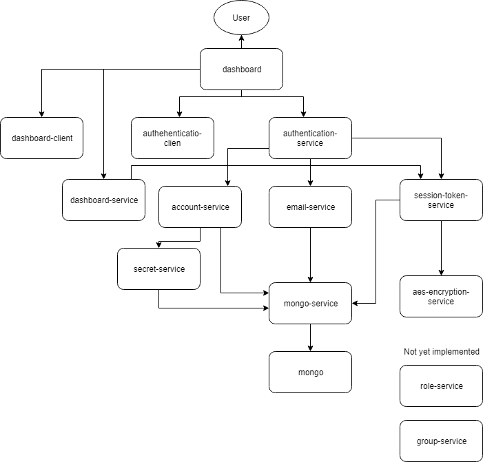

# ci-project-kube
## Description
This project will explore to set up a continuous integration pipeline for an application that provides a login system consisting of 
14 components. This will be achieved using kubernetes, jenkins and docker-compose. The architecture diagram below displays the 
connections between the 14 services. (Note: this project builds on a previous project https://github.com/Sajith75/ci-project)

## Architecture Diagram


## Prerequisites
The images of the microservices required for this project can be accessed from docker hub:
* sajith75/mongo-service
* sajith75/aes-encryption-service
* sajith75/email-service
* sajith75/secret-service
* sajith75/account-service
* sajith75/session-token-service
* sajith75/dashboard-service
* sajith75/authentication-service
* sajith75/dashboard-client
* sajith75/authentication-client
* sajith75/gateway
* sajith75/role-service
* sajith75/group-service

access to google cloud platform is also required for this project

## Setup
### Kubernetes
1. Create a kubernetes cluster using the cloud shell

2. Clone this repository https://github.com/Sajith75/ci-project-kube.git

3. Run the services folders using ```kubectl apply -f services```, ```kubectl apply -f deployments```, ```kubectl apply -f gateway```

4. Once the services are running the external ip of the load balancer can be acquired using the command ```kubectl get services```. In the authentication-service-deployment.yaml the localhost part in the ACTIVATION_LINK environment varibale needs to be replaced with the external ip.

5. The deployment services needs to be restarted after, this can be done by running the commands ```kubectl delete -f deployments``` and ```kubectl apply -f deployments```

6. The login page can now be accessed by going to the external ip followed by /authentication/login.

### Jenkins
1. Run the Jenkins yaml files using the command ```kubectl apply -f deployments```.

1. Jenkins => A change to the source code on GitHub => triggers a jenkins job using webhooks => Docker images are rebuilt and pushed to Docker hub => Kubernetes pods are updated and run new images.
